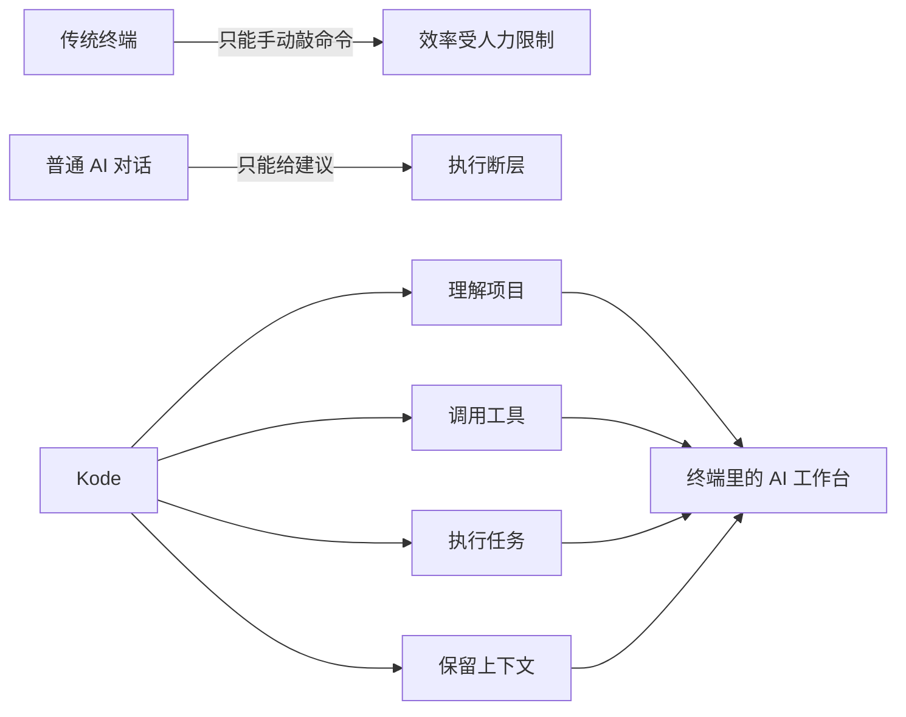
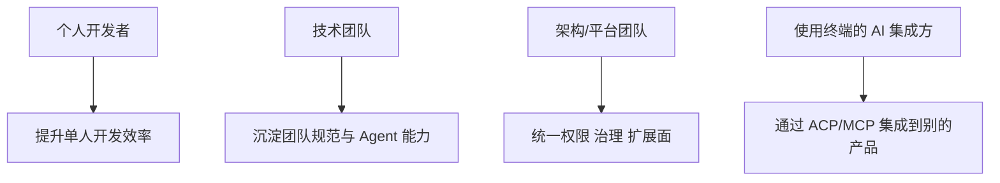
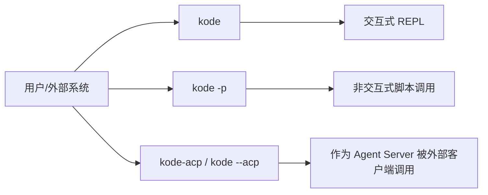
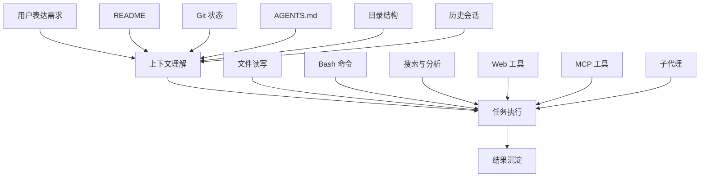
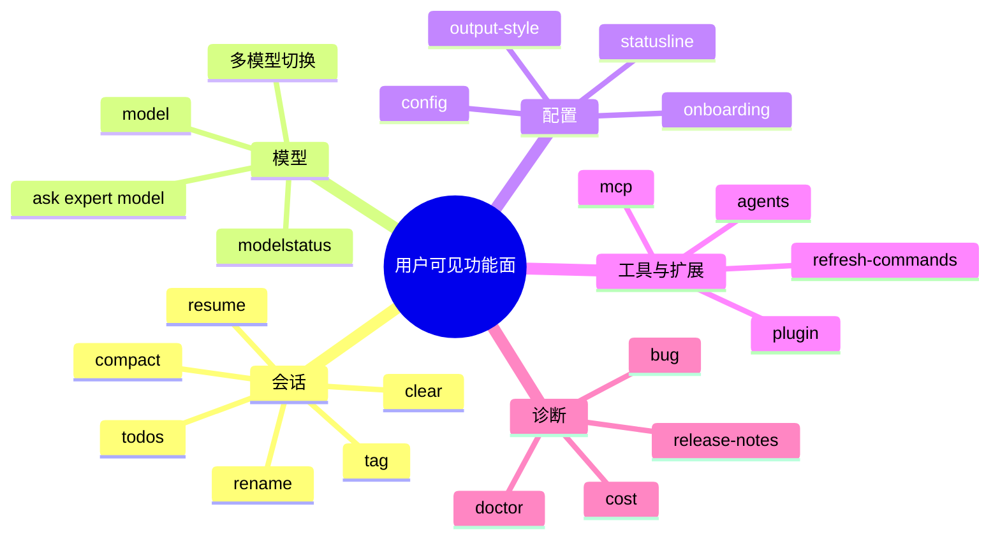
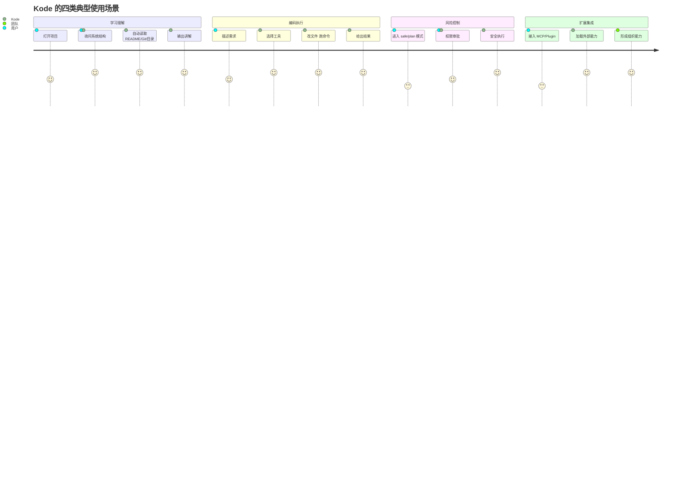
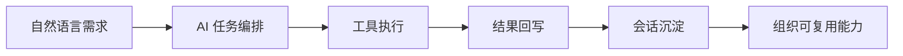

# Kode 产品地图：它到底在卖什么能力

## 一句话定义

Kode 是一个运行在终端里的 AI 工作代理。它不是只负责聊天，而是把“理解代码库、读取上下文、调用工具、执行命令、写回结果、保存会话”整合成一个持续工作的终端助手。

## 把它理解成什么最准确



## 这个产品在解决什么核心矛盾

### 用户真实痛点

- 终端很强，但门槛高，很多操作需要记忆命令、路径和上下文。
- 普通 AI 能解释，但做不到稳定落地执行。
- 自动化脚本能跑，但对复杂、模糊、变化快的任务不够灵活。
- 一旦任务跨文件、跨命令、跨上下文，用户很容易丢失全局。

### Kode 的解决方式

- 让用户用自然语言下达复杂任务
- 自动补齐项目上下文
- 让模型按需选择工具执行
- 用权限体系兜底风险
- 把整个过程沉淀为可恢复的会话与可扩展的系统

## 主要用户角色



## 用户能从哪些入口进入系统

项目里至少存在三种非常明确的入口形态。



### 入口 1：交互式 REPL

适合持续对话、反复调试、边看边改、边执行边确认。

### 入口 2：Print Mode

适合脚本化、管道化、CI/CD、一次性执行。

### 入口 3：ACP Agent Server

适合被其他工具或编辑器当作“后端智能体”接入。

## 产品能力并不是一层，而是四层



## 从“用户视角”看它到底能做什么

### 1. 解释与理解

- 看懂代码库
- 解释函数、模块、依赖关系
- 结合 README、Git、目录结构来理解项目背景

### 2. 修改与生成

- 直接编辑文件
- 写新文件
- 批量修改
- 写 TODO、计划、结构化输出

### 3. 执行与验证

- 运行 shell 命令
- 搜索文件和代码
- 调 Web Search / Web Fetch
- 调用 MCP 扩展工具

### 4. 协作与委派

- 临时咨询专家模型 `@ask-*`
- 把任务分派给子代理 `@run-agent-*`
- 加载自定义 agents、skills、plugins

## 终端里的产品面板，其实已经很完整



## 用户使用路径不是单一的，而是四种典型场景



## 这个项目最重要的产品差异点

### 差异点 1：不是“模型产品”，而是“模型编排产品”

项目代码里同时存在模型管理、系统提示词增强、工具执行、会话恢复、自动压缩、插件装配，这说明它真正的竞争力不是某个模型，而是把模型放进一套可持续工作的壳里。

### 差异点 2：不是“IDE 插件”，而是“终端原生工作台”

它的自然场景不是可视化编辑器，而是命令行、脚本、自动化和开发者高频终端操作。

### 差异点 3：不是“一个工具”，而是一套操作系统雏形

这个仓库已经包含：

- 入口
- 路由
- 工具注册
- 权限系统
- 上下文系统
- 扩展系统
- 协议接入

这意味着它具备平台化雏形。

## 命令面可以分成 6 个业务域

```mermaid
flowchart TB
    A[命令面]
    A --> B[会话管理]
    A --> C[模型与配置]
    A --> D[扩展接入]
    A --> E[诊断运维]
    A --> F[项目初始化]
    A --> G[协作辅助]

    B --> B1[/clear]
    B --> B2[/compact]
    B --> B3[/resume]
    B --> B4[/rename]
    B --> B5[/tag]
    B --> B6[/todos]

    C --> C1[/model]
    C --> C2[/modelstatus]
    C --> C3[/config]
    C --> C4[/onboarding]
    C --> C5[/output-style]

    D --> D1[/mcp]
    D --> D2[/plugin]
    D --> D3[/agents]
    D --> D4[/refresh-commands]

    E --> E1[/doctor]
    E --> E2[/cost]
    E --> E3[/release-notes]
    E --> E4[/bug]

    F --> F1[/init]
    F --> F2[/statusline]

    G --> G1[/review]
    G --> G2[/pr-comments]
```

## 这几个点最值得从业务上持续深挖

### 1. 用户入口层的分层价值

一个产品能同时支持 REPL、命令行批处理、协议服务端，说明它既面向个人开发者，也面向自动化和平台集成。

### 2. 项目上下文注入机制

系统会主动装配 README、Git 状态、目录结构、AGENTS.md/CLAUDE.md，这使它比“纯对话机器人”更接近“项目成员”。

### 3. 工具化执行闭环

从工具列表看，它已覆盖文件、搜索、命令、网页、MCP、子代理等关键执行面，业务上已经具备“从理解到落地”的闭环。

### 4. 组织知识沉淀能力

AGENTS.md、skills、plugins、agents、project settings 共同构成“团队经验可复用”的能力层，这对团队场景非常关键。

### 5. 协议和生态边界

ACP 和 MCP 说明它不是只想做一个前端应用，而是在争夺“AI 开发工作流底座”的位置。

## 如果要给管理层汇报，可以这样概括



一句话：Kode 的核心资产不是一个聊天框，而是一套把开发工作流自动化、可治理化、可沉淀化的终端 AI 操作层。
