# Kode 请求全链路：一条需求是怎样被执行出来的

这篇文档只回答一个问题：当用户在 Kode 里输入一句话后，系统内部到底发生了什么。

## 先看一张总图

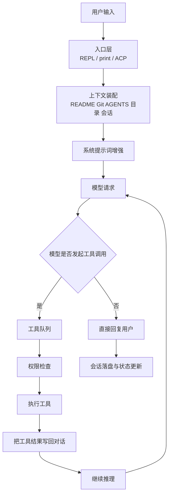

## 第 0 步：用户从哪个入口进来

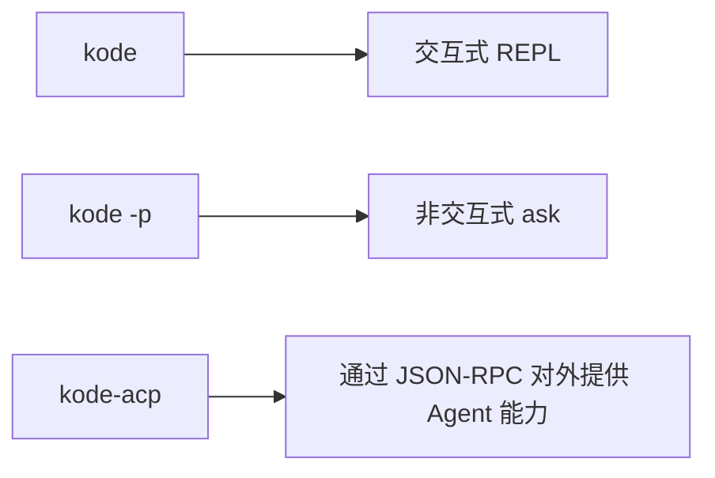

这三种入口最后都会汇聚到同一套编排逻辑，只是交互方式不同。

## 第 1 步：系统先决定“这句话是什么类型”

用户输入到达后，不会立刻交给模型，而是先分流。

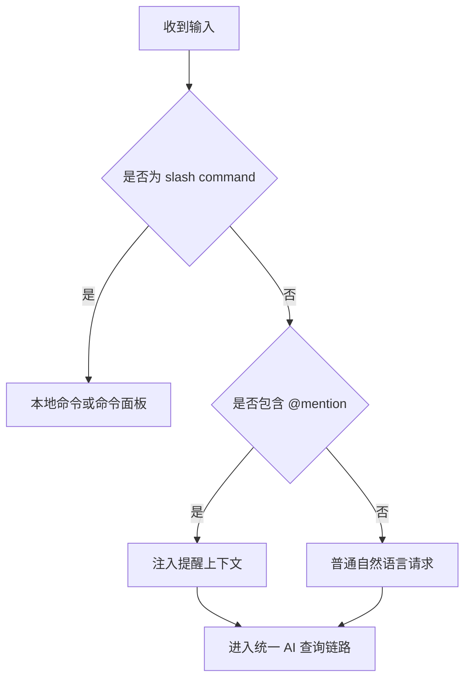

### 这里的三种输入含义

- `/xxx`：走命令系统，比如 `/model`、`/plugin`、`/mcp`
- `@ask-*`：触发专家模型咨询倾向
- `@run-agent-*`：触发子代理委派倾向
- `@file/path`：提示系统用户正在引用特定文件

## 第 2 步：系统拼装“模型真正看到的上下文”

这一步是项目最关键的业务价值之一。模型拿到的不是裸问题，而是“问题 + 项目现场”。

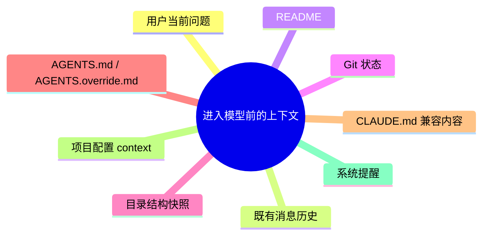

### 系统为什么要主动补上下文

因为用户经常不会把背景讲完整，真正的业务价值来自系统主动知道：

- 当前项目是什么
- 现在 Git 工作区是什么状态
- 团队要求代理遵守什么规则
- 之前已经聊到哪一步

## 第 3 步：系统提示词不是固定文案，而是动态增强

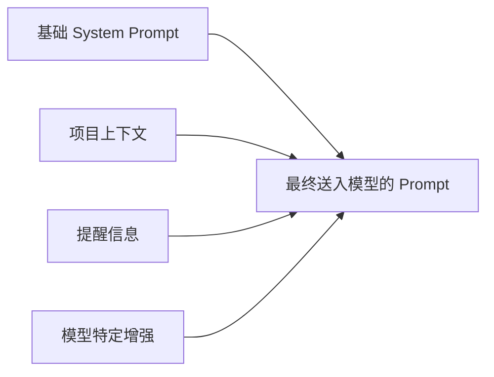

动态增强的价值在于：

- 不同模型可以收到不同的补充提示
- 提及文件/agent/model 时能得到额外提醒
- 项目规范能稳定注入，而不是依赖用户重复说明

## 第 4 步：模型开始推理，并决定是否调用工具

从业务上讲，模型在这里扮演的是“调度中心”，不是“执行者本体”。

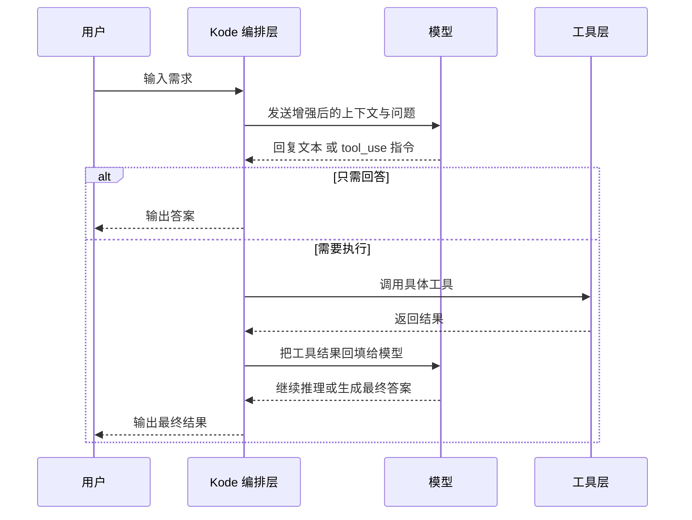

## 第 5 步：工具不是随便调用，而是进入工具队列

项目里存在一个非常明确的“工具队列”概念，这意味着系统把工具调用当作可调度任务来管理，而不是临时函数调用。

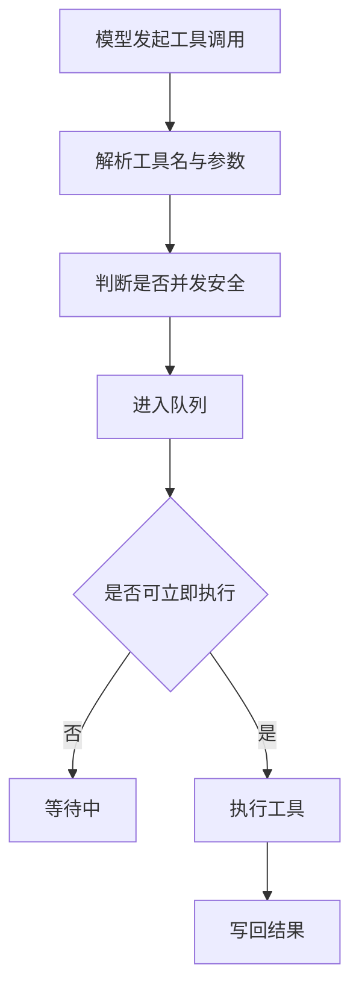

### 这里的业务意义

- 可以避免多个危险工具同时乱跑
- 只让“可并发的安全工具”并发执行
- 执行中可以给用户显示进度

## 第 6 步：每个工具都会经过权限与输入校验

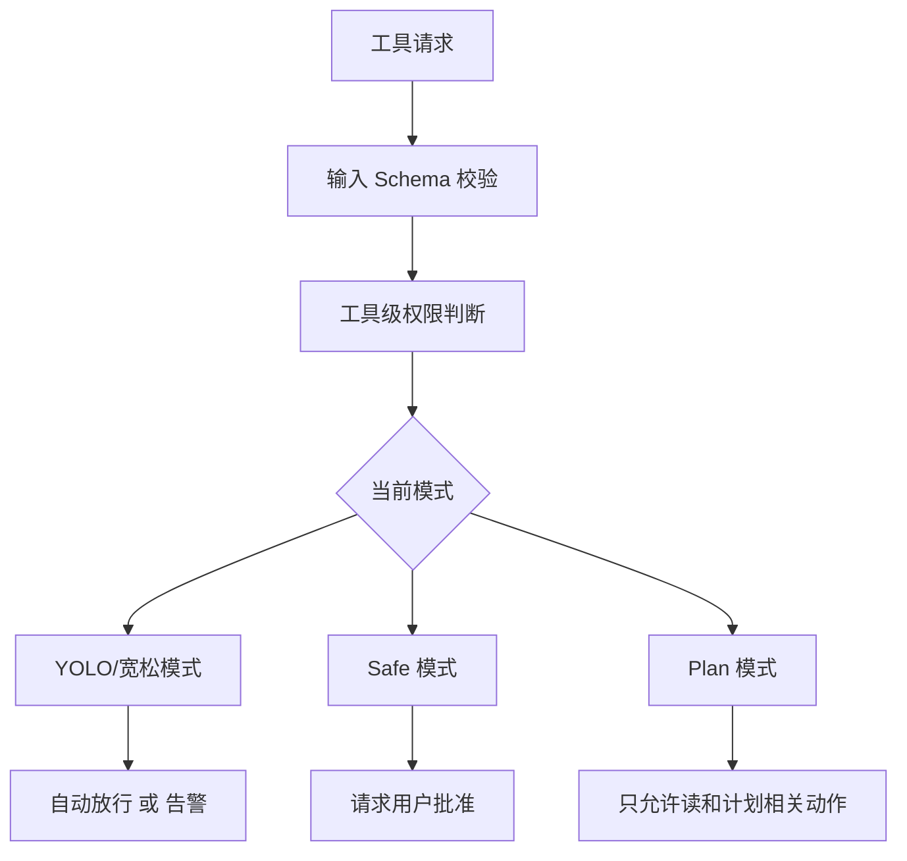

### 项目里的工具家族

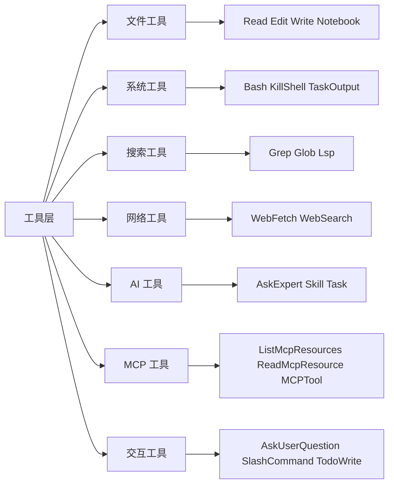

## 第 7 步：工具执行结果不会直接结束，而是会回填给模型继续思考

很多人会误以为“工具执行完就结束了”，其实不是。工具结果只是中间材料。

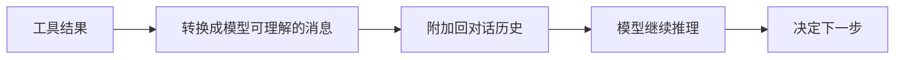

下一步可能是：

- 继续调用别的工具
- 输出用户可读答案
- 让子代理接手
- 进入等待或中断状态

## 第 8 步：如果需要，还会调用子代理或专家模型

这是 Kode 从“单体助手”走向“协作系统”的关键点。

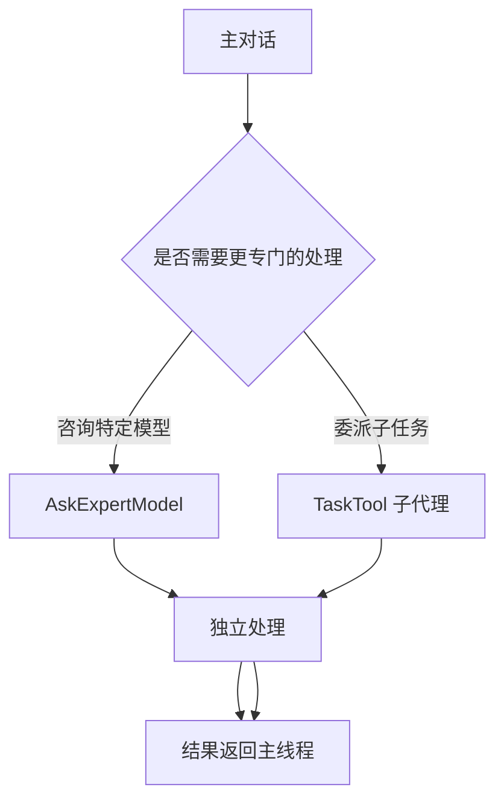

### 两种协作方式的区别

| 方式 | 本质 | 适合什么 |
|---|---|---|
| `@ask-*` / AskExpertModel | 临时咨询另一个模型 | 获得第二视角、专家意见 |
| `@run-agent-*` / TaskTool | 拉起具备角色设定与工具边界的子代理 | 分工执行、复杂子任务 |

## 第 9 步：会话会被持续保存，不是“一次性回答”

系统会把消息落到 JSONL 日志中，并维护 session id、slug、tag、title 等元数据。

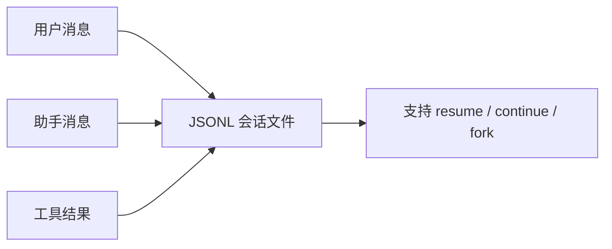

这意味着业务上它不是“瞬时响应产品”，而是“持续任务产品”。

## 第 10 步：上下文过长时，系统会自动压缩记忆

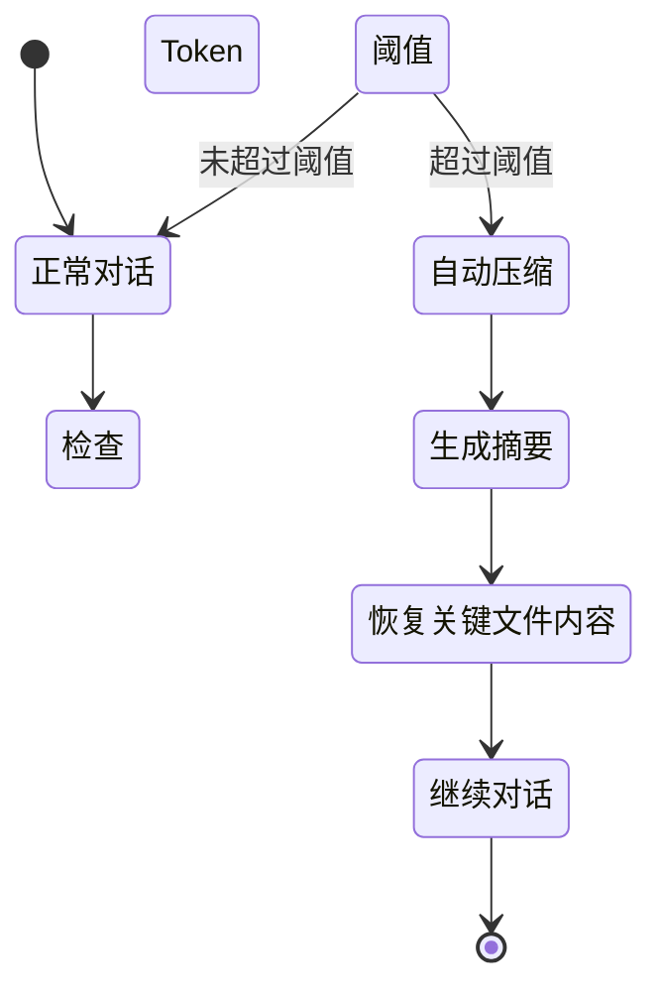

### 自动压缩的业务意义

- 让长会话不至于因为上下文过长而崩掉
- 尽量保留关键状态而不是硬清空
- 让“长期任务”有持续性

## 一条完整请求的生命周期

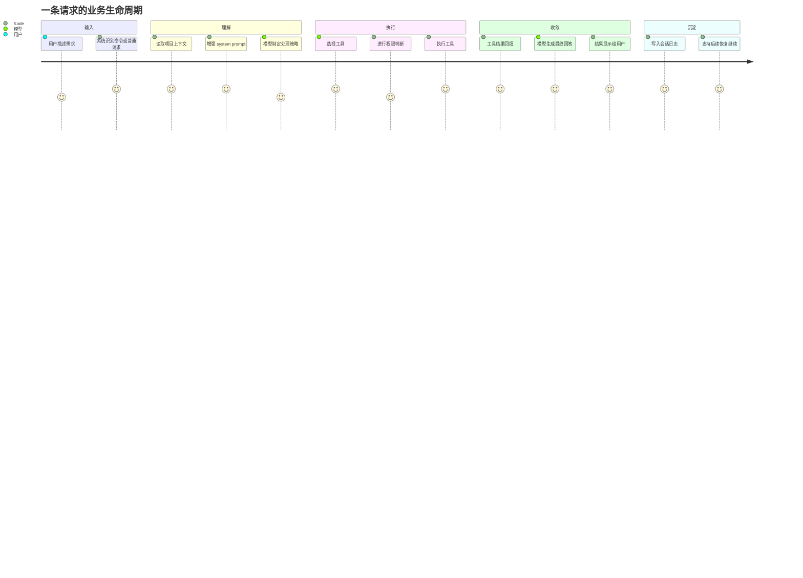

## 这一整条链路里，最值得你从业务上盯住的点

### 1. 上下文装配质量

它决定系统是不是“真的懂项目”，而不只是“回答得像懂”。

### 2. 工具选择质量

它决定模型能不能把抽象需求真正落地成动作。

### 3. 权限与队列治理

它决定自动化能力会不会变成风险。

### 4. 会话稳定性

它决定产品能不能承接长任务、复杂任务、多人协作任务。

### 5. 子代理与专家协作

它决定系统有没有从单 Agent 升级为多 Agent 编排平台的潜力。

## 最后用一句话总结

Kode 的请求处理链路，本质上是：

“把自然语言需求，经过上下文增强、模型决策、工具执行、权限治理和会话沉淀，转化成一个可持续的终端工作流。”
