# Kode 的安全、记忆与治理：为什么它能自动干活但又不完全失控

如果说上一篇讲的是“系统怎么跑”，这一篇讲的就是“系统为什么能稳”。

对一个终端 AI 代理来说，真正的风险不在回答错一句话，而在于：

- 命令跑错
- 文件改错
- 长会话失忆
- 子代理乱扩散
- 扩展能力越多，边界越模糊

Kode 的重要价值之一，就是把这些问题尽量做成可治理系统。

## 一张图先看治理结构

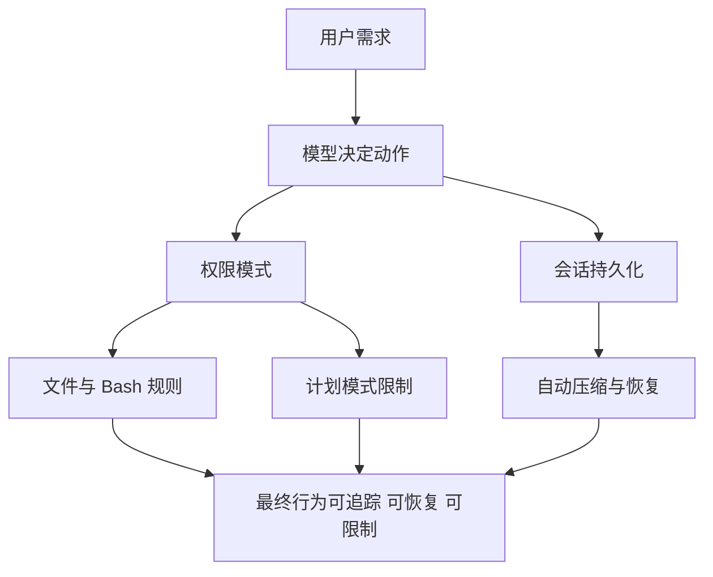

## 第一层治理：权限模式本身就是业务策略

Kode 不是只有“允许/不允许”两种状态，而是存在模式切换。

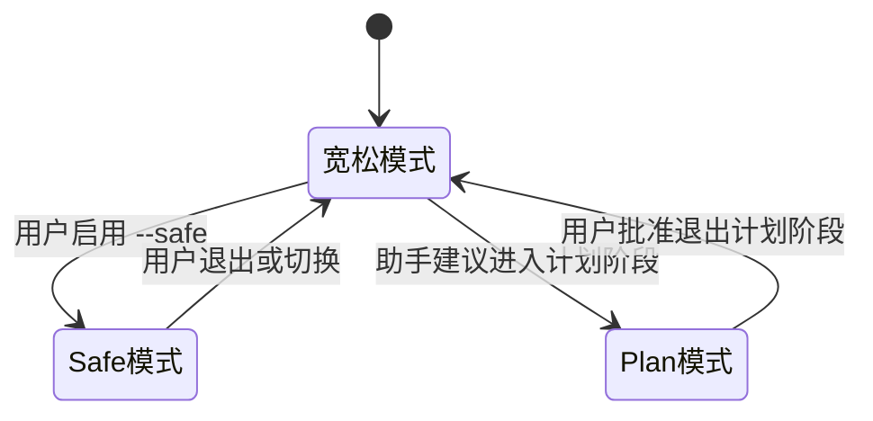

### 三种最重要的业务模式

| 模式 | 核心特征 | 业务价值 | 风险特征 |
|---|---|---|---|
| 默认/YOLO/宽松 | 尽量少打断，强调效率 | 适合熟悉环境、快速开发 | 风险最高 |
| Safe | Bash、文件编辑等需要更严格审批 | 适合重要项目或高风险操作 | 速度较慢 |
| Plan | 先规划，不允许直接放开执行 | 适合方案设计、复杂任务前置治理 | 最保守 |

## 第二层治理：不是所有工具都一样危险

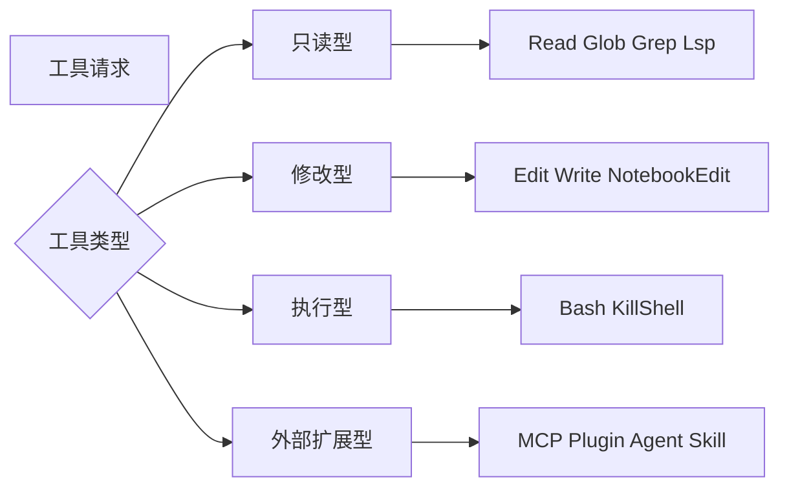

### 从业务风险看，危险度大致是

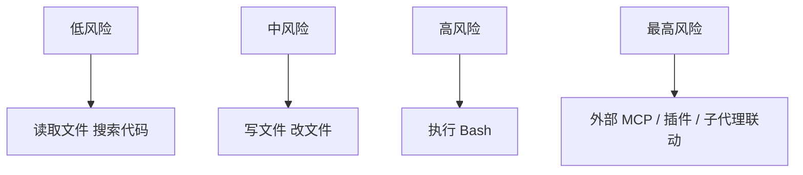

## 第三层治理：文件权限不是简单路径判断，而是“边界判断”

从代码看，文件权限引擎会做很多事：

- 解析类似 CLI 的路径
- 展开符号链接
- 识别敏感目录和敏感文件
- 防止写入某些配置文件和技能/命令目录
- 避免路径穿越或可疑 Windows 路径模式

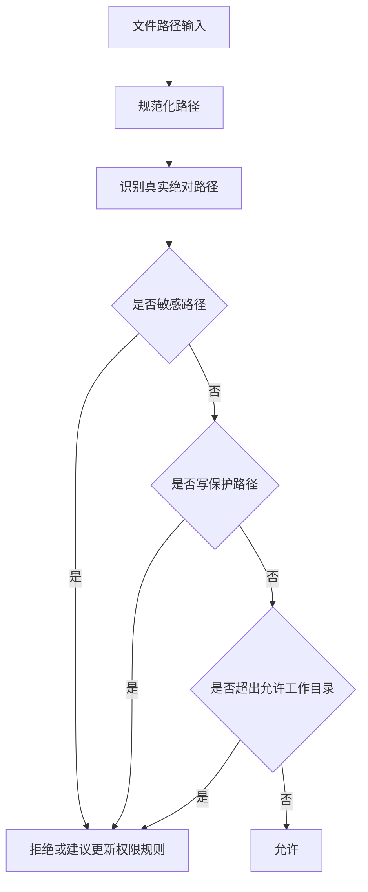

### 业务意义

这不是“技术洁癖”，而是为了防止 AI 在无意中碰：

- `.git`
- `.ssh`
- `.kode/.claude` 核心配置
- shell 配置文件
- 团队规则本身

## 第四层治理：Bash 权限不是黑盒，而是逐段分析

从 Bash 权限引擎可以看出，系统会：

- 拆分多段命令
- 识别分隔符
- 还原 shell token
- 判断重定向、子命令和路径风险

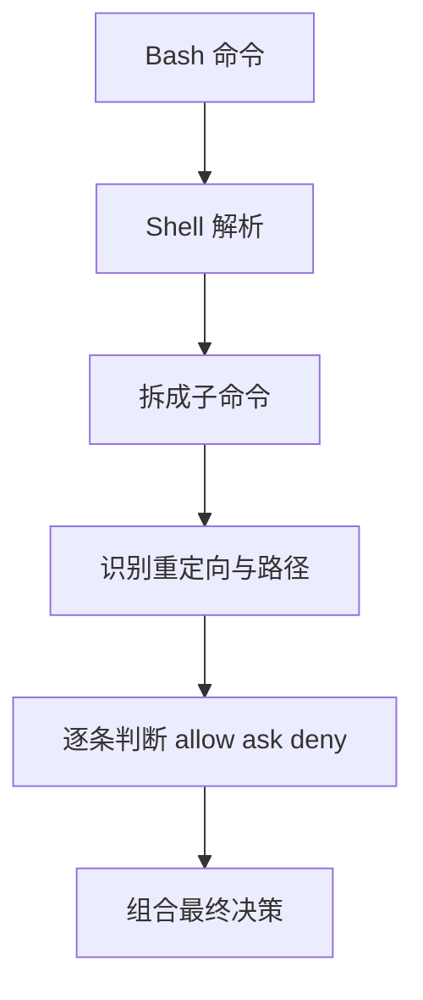

### 业务意义

这说明系统不是“看到 Bash 就统一放行/拦截”，而是在努力做细粒度治理。对企业或团队场景来说，这一点非常关键。

## 第五层治理：Plan 模式是“先想清楚再动手”

Plan 模式是一个非常值得挖掘的业务能力，因为它把“计划”和“执行”分层了。

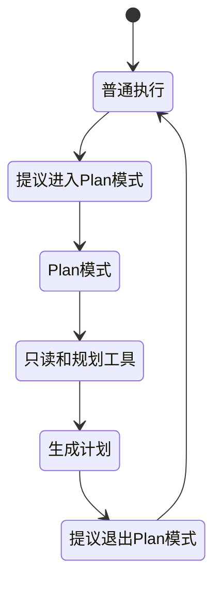

### Plan 模式的业务价值

- 降低复杂任务直接误操作的风险
- 强制先形成可审阅方案
- 让用户能在真正执行前看到思路
- 很适合企业审批链、敏感变更、基础设施任务

## 第六层治理：会话不是临时缓存，而是业务资产

系统会把消息写进 JSONL，会话具备：

- session id
- slug
- 自定义标题
- tag
- agent sidechain
- 文件历史快照

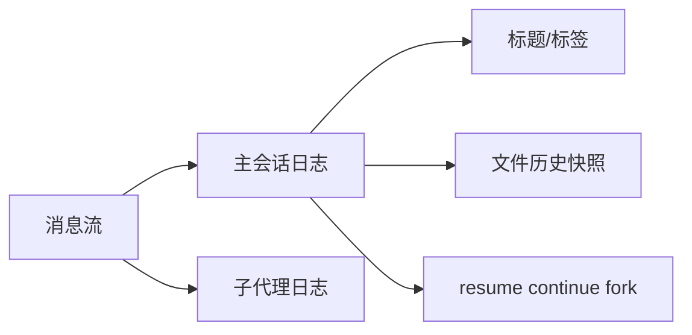

### 为什么说这是业务资产

因为这意味着：

- 可以恢复未完成任务
- 可以追溯发生过什么
- 可以把一次对话变成长期项目资产
- 未来可以衍生审计、分析、复盘、知识沉淀功能

## 第七层治理：自动压缩不是“删历史”，而是“生成可继续工作的记忆”

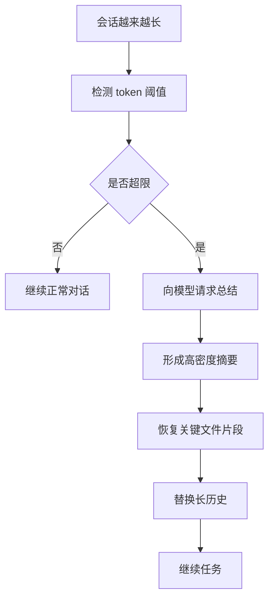

### 这件事为什么重要

AI 产品经常败在“越聊越笨”。自动压缩的本质是：

- 保住长期任务连续性
- 把上下文从“原始堆积”变成“结构化记忆”
- 减少因上下文窗口限制导致的质量下降

## 第八层治理：项目说明文件本身也是治理机制

系统会读取：

- `AGENTS.md`
- `AGENTS.override.md`
- `CLAUDE.md`
- README

而且是从 Git 根到当前目录按层叠顺序发现。

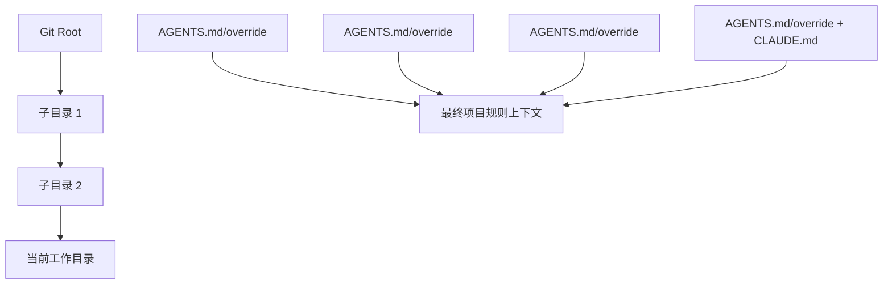

### 业务意义

这套机制让团队可以把：

- 开发规范
- 风险边界
- 编码风格
- 工作方式

直接注入给代理，让代理越来越像“守规矩的团队成员”。

## 用一张风险漏斗来理解 Kode 的治理逻辑

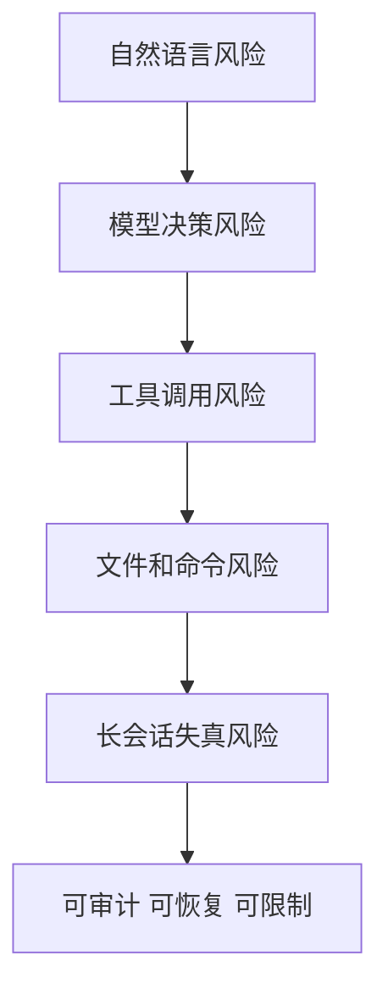

每一层都不可能 100% 消灭风险，但可以逐层削减风险暴露面。

## 业务上最值得继续挖的治理方向

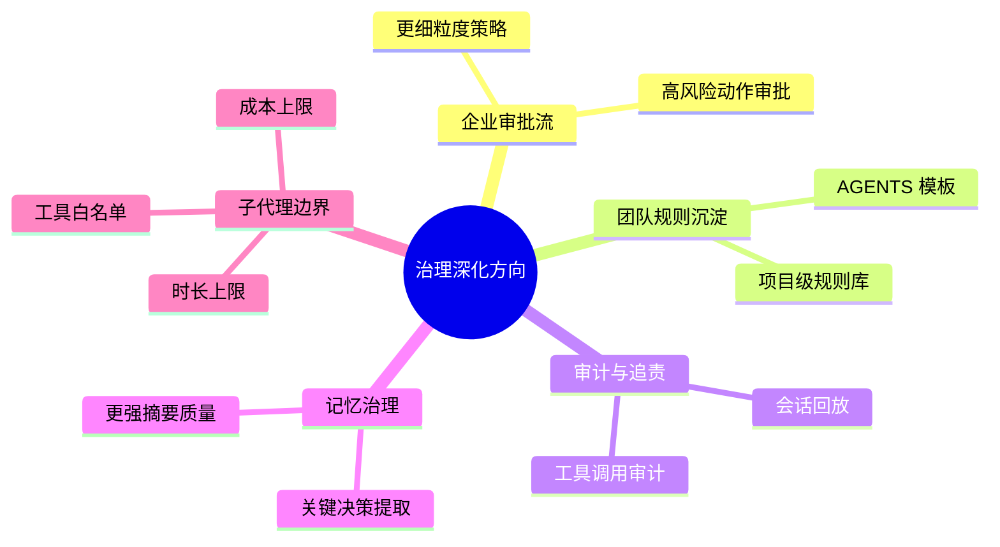

## 给非技术同学的最终理解

可以把 Kode 想象成一个“会动手的数字员工”，而这一整套权限、记忆和治理系统，就是它的：

- 岗位制度
- 审批制度
- 工作日志
- 交接手册
- 风险控制线

没有这些，AI 只能“看起来很聪明”；有了这些，它才有机会在真实业务里长期工作。
