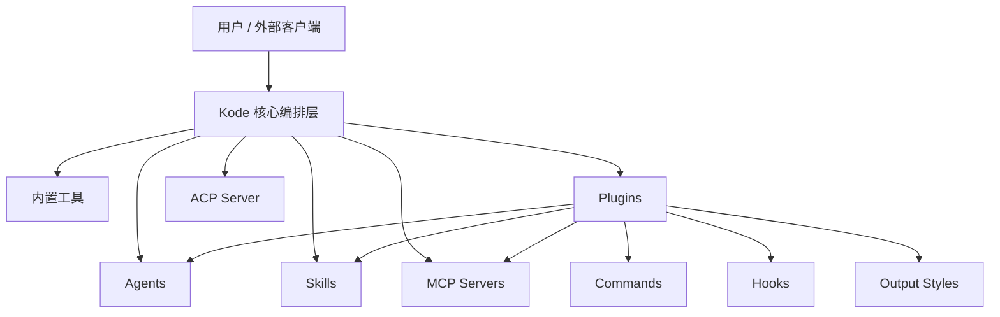
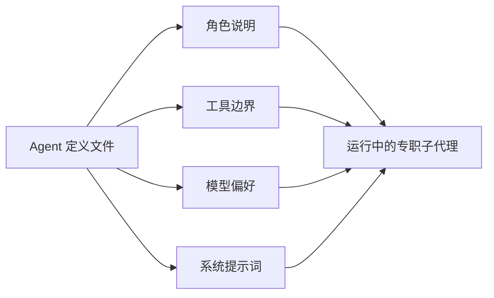
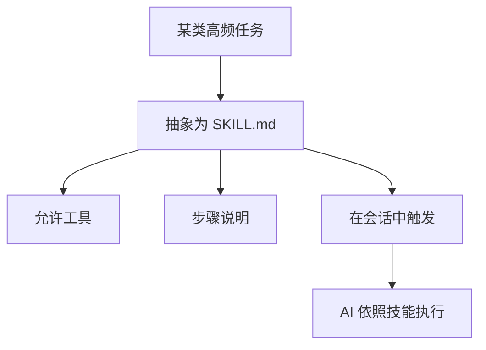
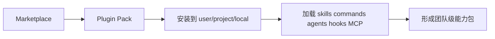
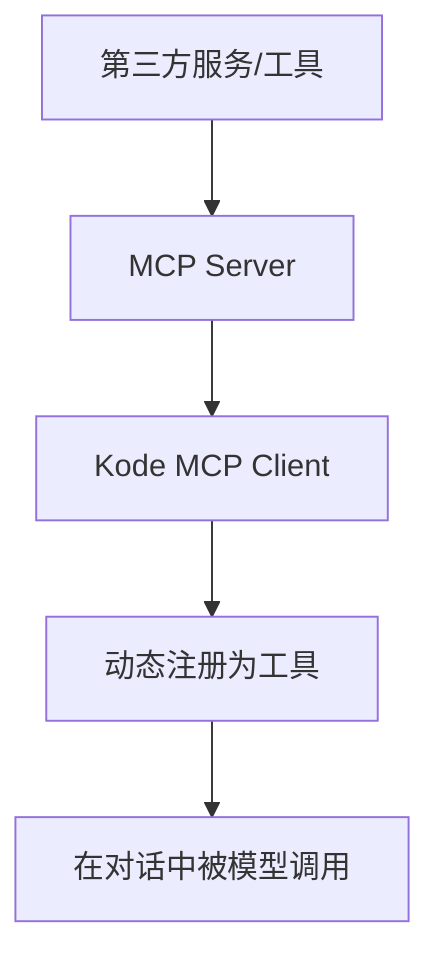
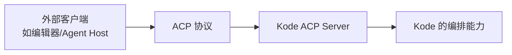
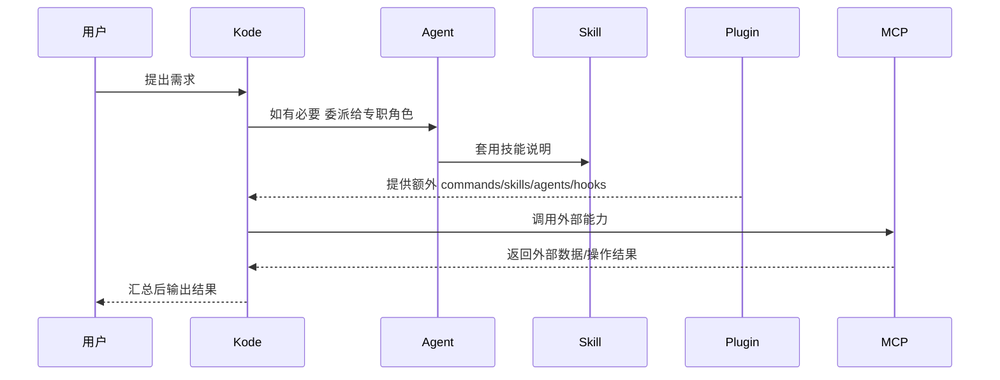
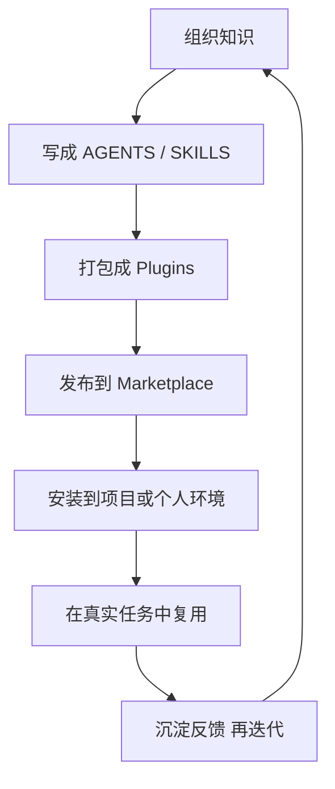
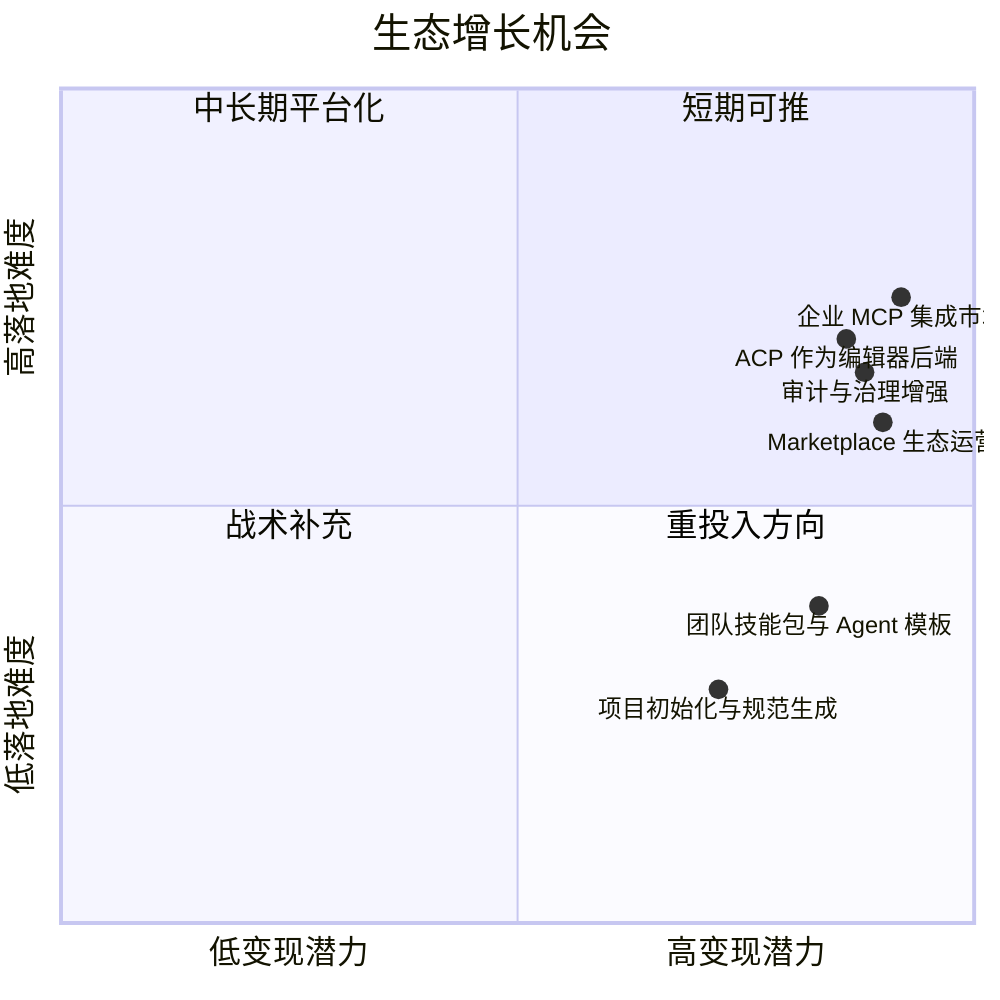

# Kode 的平台生态与扩展边界：它为什么不只是一个 CLI

如果只看表面，Kode 像一个终端助手；如果看代码结构，它已经明显在往“平台底座”发展。

这一篇重点讲：

- MCP
- plugins
- skills
- agents
- ACP

这些东西各自是什么，它们怎么配合，以及它们在业务上意味着什么。

## 先看一张平台全景图

## 五种扩展能力的业务定位

| 能力 | 本质角色 | 解决的问题 | 更像什么 |
|---|---|---|---|
| Agents | 专业分工角色 | 把不同任务交给不同“岗位” | 员工岗位 |
| Skills | 可复用操作说明书 | 把高频任务封装成套路 | SOP |
| Plugins | 打包分发单元 | 把 skills/commands/agents/hooks 一起交付 | 插件包 |
| MCP | 外部能力接入标准 | 把第三方工具/服务接入系统 | 外部接口总线 |
| ACP | 对外服务协议 | 让 Kode 反过来被别的产品调用 | 平台 API/Agent 服务 |

## 1. Agents：把 AI 从“一个人”变成“一个组织”

Agents 是角色配置系统。它们通过 Markdown + frontmatter 定义：

- 名称
- 描述
- 允许使用的工具
- 偏好的模型
- 专用系统提示词

### 业务价值

- 让“测试代理”“审查代理”“架构代理”各司其职
- 让团队经验变成可复用角色模板
- 让复杂任务可以分工协作，而不是全靠一个主代理

## 2. Skills：把经验变成可执行说明书

skills 的核心不是代码，而是“结构化操作方法”。

### 业务价值

- 降低提示词重复成本
- 让组织 know-how 被复用
- 更容易标准化培训新成员和新代理

## 3. Plugins：让能力可以打包、安装、启停、分发

插件系统的关键不只是“扩展”，而是“交付与运营”。

### 从代码结构看，plugin 可以带来什么

- skills
- commands
- agents
- hooks
- output styles
- MCP 配置

这已经不是一个狭义插件，而是“能力包分发格式”。

## 4. MCP：让 Kode 能接第三方世界

MCP 在这里的定位非常清晰：它负责把外部工具和资源接进来。

### 为什么 MCP 特别重要

因为内置工具再多，也覆盖不了所有业务场景。MCP 让 Kode 不需要自己重做所有集成，只要把外部能力转成统一工具接口即可。

### 对业务侧意味着什么

- 能接企业内部系统
- 能接 IDE、知识库、数据库、运维平台
- 能把 Kode 从“本地助手”变成“组织工作流枢纽”

## 5. ACP：让 Kode 反向成为别人的能力底座

ACP 的方向和 MCP 相反。

### 业务意义

MCP 是“我接别人”，ACP 是“别人接我”。

一个系统同时做这两件事，意味着它在争夺中间层位置：

- 向下接工具
- 向上接客户端

这就是平台雏形。

## 这五层能力怎么互相配合

## 组织视角下，这是一套能力供应链

这张图很关键，因为它说明 Kode 不是只在运行时发挥作用，它也在承接“组织知识生产和分发”。

## 为什么说这个仓库已经有明显的平台化信号

### 信号 1：有能力接入外部能力

MCP。

### 信号 2：有能力输出自身能力

ACP。

### 信号 3：有能力打包和分发组织知识

plugins + marketplace + skills + agents。

### 信号 4：有能力做角色化协作

TaskTool + agents + AskExpertModel。

### 信号 5：有能力做项目级治理

AGENTS.md + settings + permission system。

## 如果从商业和产品增长看，最值得挖的方向

## 适合进一步深挖的 10 个问题

### 1. 哪些 Agent 角色最常用

如果高频角色稳定，就能反推出最适合产品化的岗位模板。

### 2. 哪些 Skills 最能复用

可复用度高的 skill 最适合做团队标准能力包。

### 3. MCP 接入的真实需求集中在哪些领域

是 IDE、知识库、数据库、测试平台，还是发布系统。

### 4. Plugin 安装更偏个人还是项目级

这决定产品重点偏向个人效率工具，还是团队协作底座。

### 5. ACP 的接入方是谁

如果 ACP 被编辑器、平台或多 Agent 宿主接得多，说明 Kode 的底座价值正在增强。

### 6. 哪些命令和能力值得收敛为模板化工作流

例如 review、PR comments、init、statusline，都有可能变成更高层“业务动作”。

### 7. 项目说明文件使用率如何

如果 AGENTS.md 被广泛使用，说明“组织规则注入”是核心卖点。

### 8. 会话恢复和 fork 使用率如何

如果高，说明它承载的不是短问答，而是长任务。

### 9. 企业最在意的是效率还是治理

这会影响你未来更偏重 YOLO 体验，还是企业级权限与审计。

### 10. 生态要先做“数量”还是“标准”

平台初期通常更需要高质量模板和清晰规范，而不是无序堆能力。

## 最后一句话概括这篇文档

Kode 的野心不是做一个会聊天的终端工具，而是做一个：

“上能被客户端接入，下能接第三方能力，中间还能沉淀组织知识和代理角色”的 AI 工作流平台底座。
