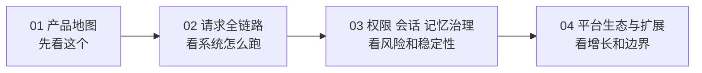
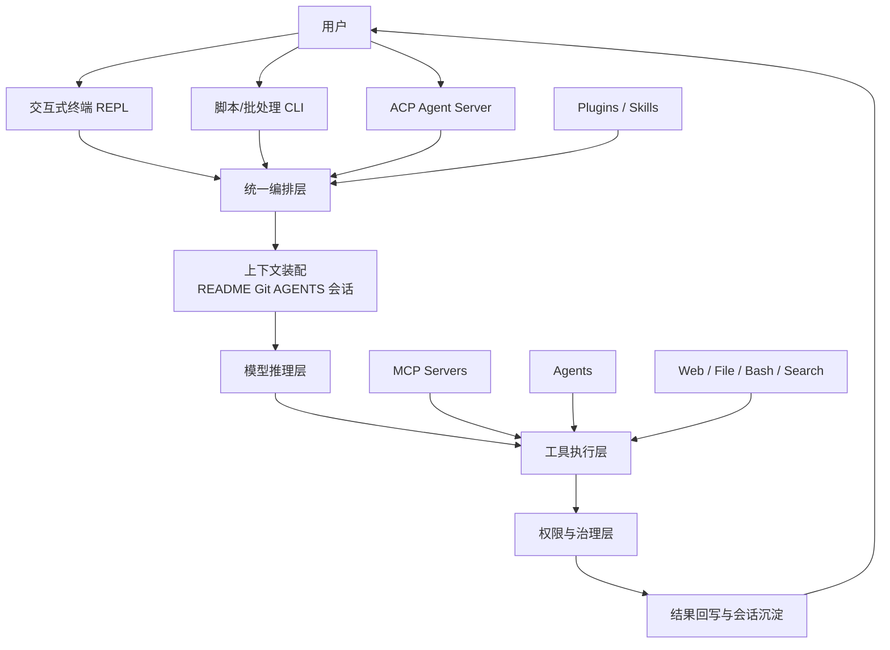
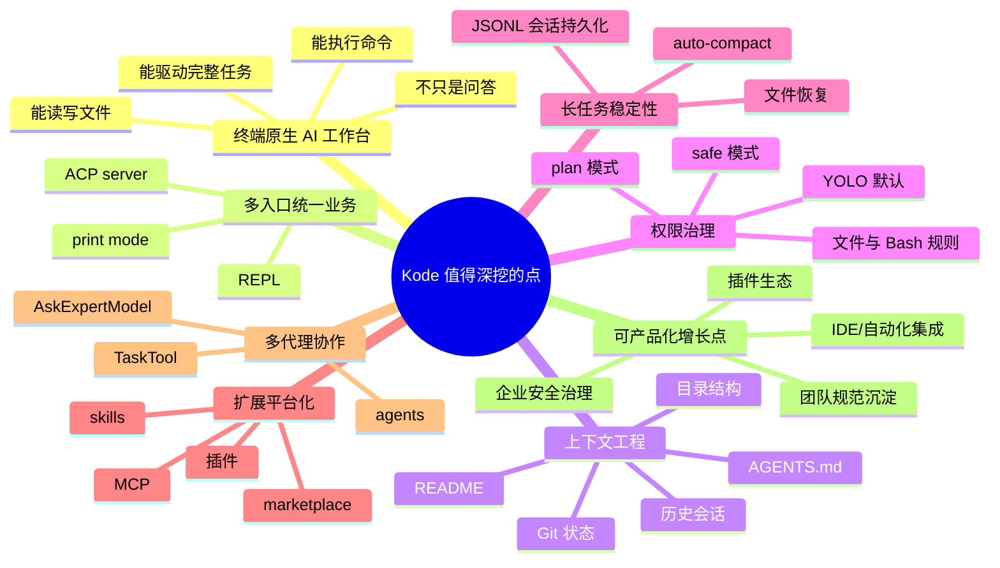
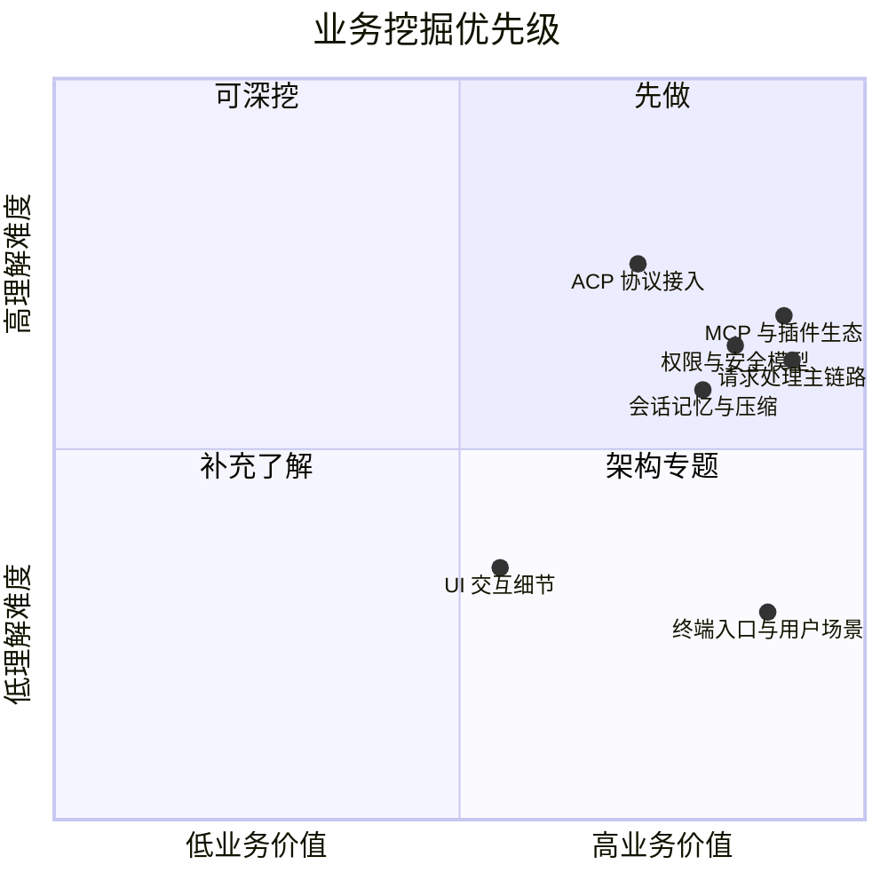

# Kode 业务梳理总览

这组文档不是从“代码目录”出发，而是从“业务系统如何运转”出发来拆解 Kode。目标是让不熟悉技术实现的人，也能顺着产品入口、执行链路、治理机制和扩展生态，一眼看清这个项目到底在解决什么问题、靠什么模块跑起来、未来还能往哪里挖。

## 建议阅读顺序

## 文档清单

| 文档 | 重点回答的问题 | 适合谁先看 |
|---|---|---|
| `business-01-product-map.zh-CN.md` | 这个产品到底是什么，用户为什么会用它 | 业务、产品、管理者 |
| `business-02-request-lifecycle.zh-CN.md` | 一条用户请求如何变成可执行动作和最终结果 | 产品、运营、架构、研发 |
| `business-03-safety-memory-governance.zh-CN.md` | 为什么它既能自动干活，又不至于失控 | 业务、风控、架构、研发 |
| `business-04-ecosystem-expansion.zh-CN.md` | 这个项目如何从“工具”走向“平台” | 业务、生态、产品负责人 |

## 一张图看完整个业务

## 这个项目最值得挖掘的 8 个点

## 如果你只想先抓业务重点

### 1. 它不是单纯的聊天机器人

Kode 的核心不是“回答问题”，而是“在终端里代表用户执行工作”。也就是说，它既是一个 AI 对话界面，也是一个任务执行系统。

### 2. 它的真正竞争力在“编排”

单个模型、单个工具、单个命令都不稀缺。稀缺的是把：

- 项目上下文
- 模型能力
- 工具权限
- 会话记忆
- 插件与外部服务

稳定地编排成一条可持续执行的工作流。

### 3. 它最像一个“终端里的 AI 操作系统”

从代码结构看，这个项目不是围绕单一功能搭建的，而是在搭：

- 入口层
- 决策层
- 工具层
- 治理层
- 扩展层

这意味着它的业务上限，不只是“辅助编码”，而是“终端工作流自动化平台”。

## 推荐你优先关注的业务问题

## 读完这组文档后你应该能回答

- Kode 面向的核心用户是谁
- 用户通过哪些入口进入系统
- 一条请求在系统内部怎么流转
- 为什么它能“自动执行”但又尽量“可控”
- 为什么这个仓库已经具备平台化和生态化的基础
- 哪些能力最适合继续做商业化、团队化或企业化扩展
